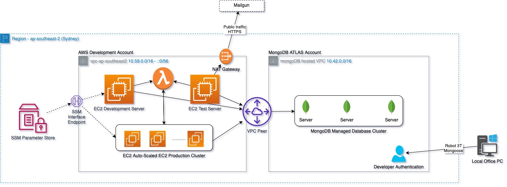

## Objective
Creates a MongoDB ATLAS cluster in the an AWS region along with user who are provided access to specifi databases. VPC peering is setup to ensure traffic between the cluster and the AWS VPC containing compute resources remain within the private AWS network.



## Prerequisites
| Requirement | Description |
| ----------- | ----------- |
| Terraform | [Installation Instructions](https://learn.hashicorp.com/tutorials/terraform/install-cli) |
| MongoDB ATLAS Account and Credentials | [Create Account](https://www.mongodb.com/) |
| AWS Account and CLI Credentials | [Create Account](https://console.aws.amazon.com/console/home) |
| Terraform Backend | [Setting up backend](https://www.terraform.io/language/settings/backends/s3)

## Installation

1. Update `setup/state.tf` file with an AWS cli profile with admin access, Terraform backend state and lock file using pre-configured S3 bucket and DynamoDB table.
2. Deploy using Terraform and AWS provider
```
cd setup
terraform plan -out infra-plan.json
terraform apply 
```
